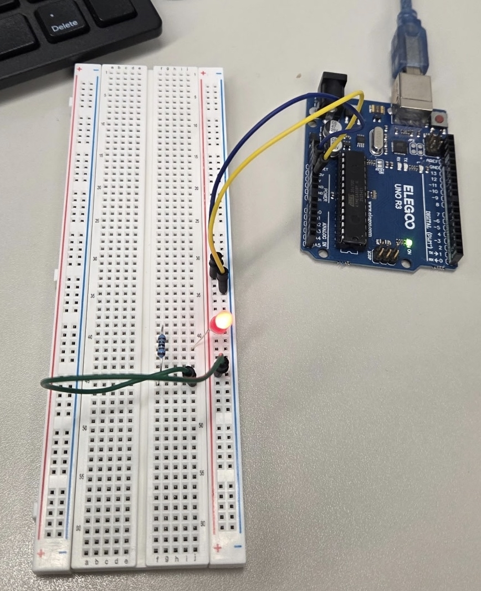

# LED Blink

## 1. Function of This Project

This project builds a basic blinking LED circuit using an Arduino Uno. The LED turns on for one second, turns off for one second, and repeats forever.

Students can modify the `delay()` values in the sketch to test how timing changes affect the physical blinking pattern.

## 2. Components Needed

- Arduino Uno
- Breadboard
- LED
- 220 ohm resistor
- Jumper wires
- USB cable for programming and power

## 3. Circuit

Connect the LED and resistor in series between Arduino Pin 13 and GND.

1. Connect Arduino digital Pin 13 to the 220 ohm resistor.
2. Connect the other side of the resistor to the long leg of the LED.
3. Connect the short leg of the LED to Arduino GND.
4. Upload the sketch and observe the LED blinking.

