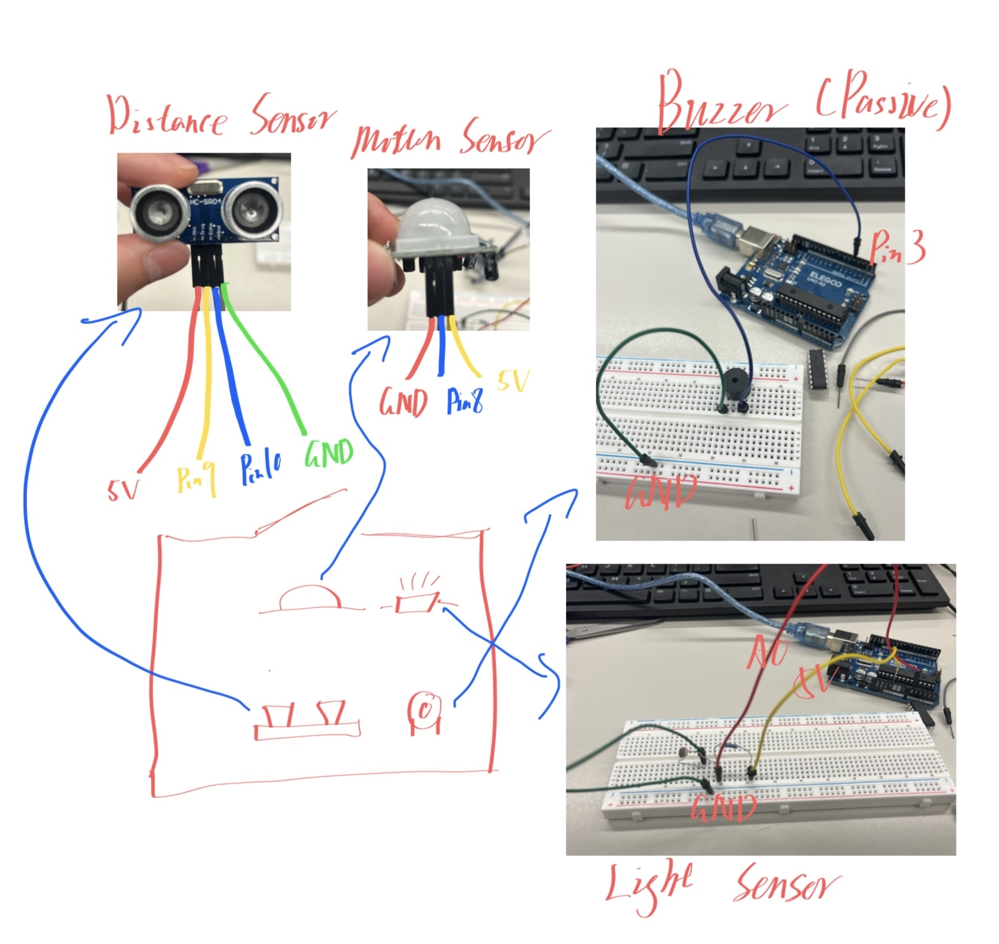

# Smart Security Box

## 1. Function

This project builds a smart security box alarm using three sensors:

- A motion sensor detects movement near the box.
- A light sensor detects when the box is opened or exposed to light.
- An ultrasonic distance sensor detects when something is very close to the box.

The Arduino stores each detection as a flag. When motion, light, and close distance are all detected, the passive buzzer turns on for 10 seconds. After the alarm finishes, the system resets and starts watching again.

The PIR motion sensor needs about 30 seconds to warm up after the Arduino is powered on.

## 2. Needed Components

- Arduino Uno
- Breadboard
- HC-SR04 ultrasonic distance sensor
- PIR motion sensor
- Photoresistor / light sensor
- 10k resistor for the light sensor voltage divider
- Passive buzzer
- Jumper wires
- USB cable for programming and power

Pin connections used in the Arduino sketch:

| Component | Arduino Pin |
| --- | --- |
| Photoresistor / light sensor | A0 |
| PIR motion sensor signal | D8 |
| Ultrasonic sensor Trig | D9 |
| Ultrasonic sensor Echo | D10 |
| Passive buzzer | D3 |

## 3. Figures

Figure 1 shows the component and pin guide for the smart security box.

Figure 2 shows the assembled smart security box circuit on the breadboard.

